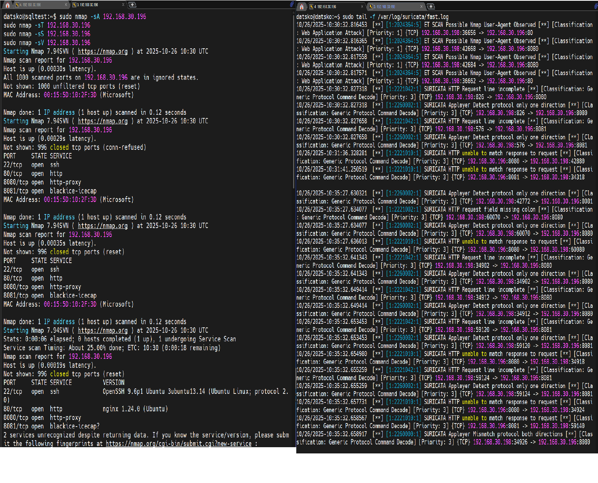
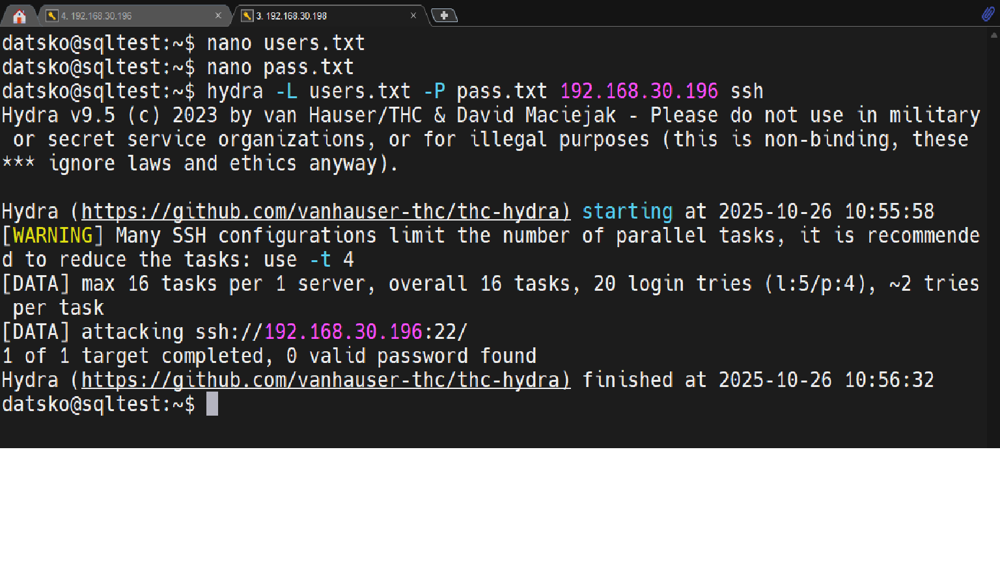
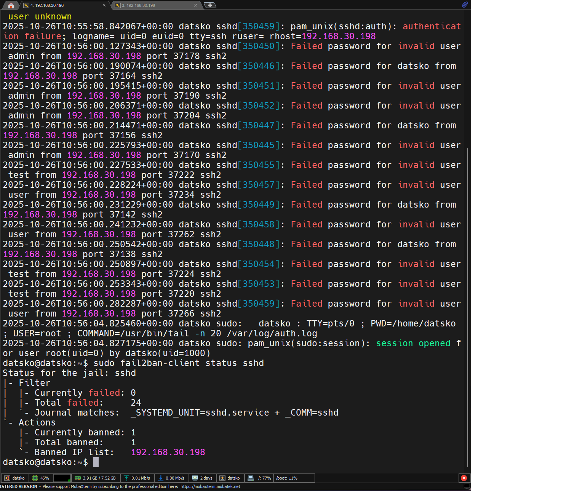

# Домашнее задание к занятию "`Защита сети`" - `Дацко Иван`


### Инструкция по выполнению домашнего задания

   1. Сделайте `fork` данного репозитория к себе в Github и переименуйте его по названию или номеру занятия, например, https://github.com/имя-вашего-репозитория/git-hw или  https://github.com/имя-вашего-репозитория/7-1-ansible-hw).
   2. Выполните клонирование данного репозитория к себе на ПК с помощью команды `git clone`.
   3. Выполните домашнее задание и заполните у себя локально этот файл README.md:
      - впишите вверху название занятия и вашу фамилию и имя
      - в каждом задании добавьте решение в требуемом виде (текст/код/скриншоты/ссылка)
      - для корректного добавления скриншотов воспользуйтесь [инструкцией "Как вставить скриншот в шаблон с решением](https://github.com/netology-code/sys-pattern-homework/blob/main/screen-instruction.md)
      - при оформлении используйте возможности языка разметки md (коротко об этом можно посмотреть в [инструкции  по MarkDown](https://github.com/netology-code/sys-pattern-homework/blob/main/md-instruction.md))
   4. После завершения работы над домашним заданием сделайте коммит (`git commit -m "comment"`) и отправьте его на Github (`git push origin`);
   5. Для проверки домашнего задания преподавателем в личном кабинете прикрепите и отправьте ссылку на решение в виде md-файла в вашем Github.
   6. Любые вопросы по выполнению заданий спрашивайте в чате учебной группы и/или в разделе “Вопросы по заданию” в личном кабинете.
   
Желаем успехов в выполнении домашнего задания!
   
### Дополнительные материалы, которые могут быть полезны для выполнения задания

1. [Руководство по оформлению Markdown файлов](https://gist.github.com/Jekins/2bf2d0638163f1294637#Code)

---

### Задание 1 Разведка системы с помощью nmap
Цель
Провести сканирование защищаемой системы различными методами и проанализировать, какие события зафиксировали Suricata и Fail2Ban.

Выполнение

С системы злоумышленника выполнены команды:

```
sudo nmap -sA 192.168.30.196
sudo nmap -sT 192.168.30.196
sudo nmap -sS 192.168.30.196
sudo nmap -sV 192.168.30.196
```
Результаты показали открытые порты:

- 22/tcp — SSH (OpenSSH 9.6p1 Ubuntu)
- 80/tcp — HTTP (nginx 1.24.0)
- 8080/tcp, 8081/tcp — дополнительные HTTP-сервисы

Анализ логов
```
Suricata (/var/log/suricata/fast.log)
```

Suricata успешно зафиксировал активность сканирования:
```
[**] [1:2024364:5] ET SCAN Possible Nmap User-Agent Observed [**] 
[Classification: Web Application Attack] [Priority: 1] 
{TCP} 192.168.30.198:42656 -> 192.168.30.196:8080
```

Также зафиксированы технические нарушения протокола HTTP (например, HTTP Request line incomplete), вызванные агрессивным версионным сканированием (-sV).

Fail2Ban
Событий не зафиксировано, так как Fail2Ban реагирует только на неудачные попытки аутентификации, а не на порт-сканирование.

Вывод
Suricata эффективно обнаруживает разведывательную активность (в том числе nmap).
Fail2Ban не срабатывает на сканирование — его задача — защита от брутфорса и перебора учётных данных.


`


---

### Задание 2 Атака на подбор пароля SSH с помощью hydra

Цель
Провести атаку методом перебора на SSH-сервис и проанализировать реакцию Fail2Ban и Suricata.

Выполнение
1. Подготовка файлов на системе злоумышленника
Созданы файлы:
- users.txt
```
datsko
admin
test
user
```
- pass.txt

```
123456
password
qwerty
secret
```

2. Настройка Fail2Ban на защищаемой системе

Создан файл /etc/fail2ban/jail.local со следующим содержимым:

```
[sshd]
enabled = true
port = ssh
logpath = /var/log/auth.log
maxretry = 3
bantime = 600
findtime = 600
```
Зафиксированы неудачные попытки:

```
Failed password for datsko from 192.168.30.198 port 37164 ssh2
Invalid user admin from 192.168.30.198 port 37190
```
fail2ban-client status sshd

```
Status for the jail: sshd
|- Currently banned: 1
`- Banned IP list:   192.168.30.198
```

`

`

IP-адрес 192.168.30.198 был автоматически заблокирован после 3 неудачных попыток.

Suricata
Событий, связанных с брутфорсом SSH, не зафиксировано, так как SSH-трафик зашифрован и не поддаётся анализу на уровне приложения без расшифровки.

---
